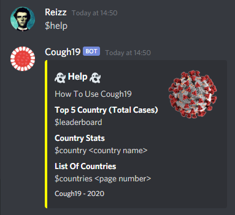
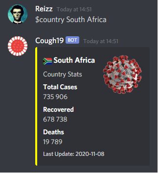
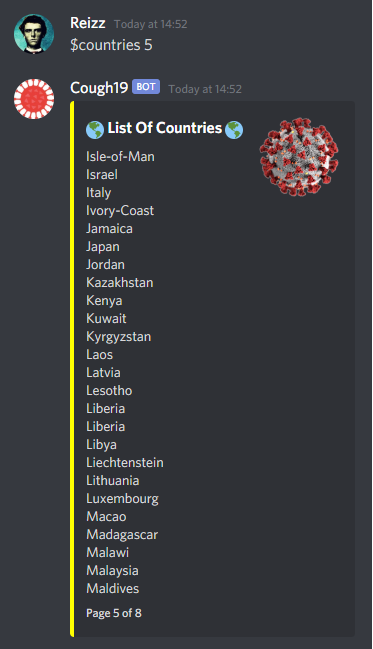

# Cough-19
A simple Covid-19 Discord bot created with discord.js.  
This bot need a RapidAPI [api](https://rapidapi.com/api-sports/api/covid-193). Make sure to subscribe to it for it to work.

## Features
* Stats (total cases, recovered and deaths) of specified country
* Leaderboard of countries with the most total cases
* Help command
* Customisable bot

## Get started
1. Create a [Discord Developer](https://discord.com/developers/docs/intro) account
2. Invite your Discord bot to the Discord serve you want to have Cough19 on
3. Subscribe on [RapidAPI](https://rapidapi.com/api-sports/api/covid-193) to get a API token
4. Replace `<discord-token>` in index.js with your Discord bot's token
5. Replace `<api-token>` in index.js with the RapidAPI token
6. Run `node cough-19/index.js`

## Customise
Change the values in `index.js` to change the bot's output.

* `name` is what the bot is called in the messages (default is Cough19)
* `prefix` is what you need to put in front of your message to call the bot (default is $)
* `color` is used to changed the color on the side of the message (default is yellow)
* `thumb` is the thumbnail in the message. Default is the one in the screenshots below

## Commands
`$help` Shows you how to use the bot

`$leaderboard` Shows the top 5 countries (total cases)

`$country <country name>` Shows you the stats for the country

`$countries <page number>` Shows a list of countries. Page number is 1 by default

## Disclaimer
A simple Discord bot I created to learn how discord.js works. For this bot to work, you need to create a RapidAPI account and subscribe to the [api](https://rapidapi.com/api-sports/api/covid-193). I might one day switch to a different api that doesn't require a sign up, but for now I'm happy with it. This project was just for the fun so don't take it too seriously.  
Good luck and have fun.
