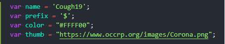
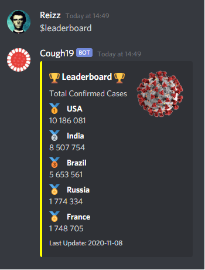

# Cough19 - Discord

## Get Started:
* Create a [Discord Developer](https://discord.com/developers/docs/intro) account
* [Subscribe](https://rapidapi.com/api-sports/api/covid-193) to get a API token
* Replace `<discord-token>` in index.js with your Discord bot's token
* Replace `<api-token>` in index.js with the API's token
* Run `node cough-19/index.js`

## Customise:
Change the values in index.js to change the bot's output.

* `name` is what the bot is called in the messages (default is Cough19)
* `prefix` is what you need to put in front of your message to call the bot (default is $)
* `color` is used to changed the color on the side of the message (default is yellow)
* `thumb` is the thumbnail in the message. Default is the one in the screenshots below

## How To Use:
`$help` Shows you how to use the bot

`$leaderboard` Shows the top 5 countries (total cases)

`$country <country name>` Shows you the stats for the country

`$countries <page number>` Shows a list of countries. Page number is 1 by default

## Final:
Fun little Sunday project to keep me busy. It's not perfect, but it works pretty well. Let me know if you see anything I can change or improve. Thanks! :)